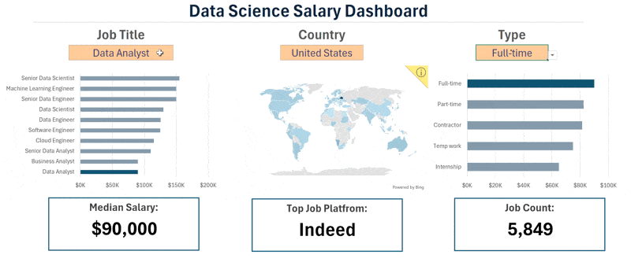

# 📊 Excel Data Analytics Projects

Collection of Excel-based data analytics projects completed as part of an advanced Excel Data Analytics course.

These projects demonstrate practical skills in:

- Data Cleaning
- Data Visualization
- Pivot Tables
- Dashboard Creation
- Salary Analysis
- Lookup Functions
- Power Query
- Data Analysis Techniques
- Excel Formulas & Functions

---

# 🛠 Skills Demonstrated

## Excel Features

- Pivot Tables & Pivot Charts
- Power Query
- Conditional Formatting
- Data Validation
- Interactive Dashboards
- XLOOKUP / VLOOKUP
- INDEX-MATCH
- IF Statements
- Charts & Visualizations

## Analytics Skills

- Data Cleaning
- Salary Trend Analysis
- KPI Reporting
- Data Visualization
- Business Insights
- Dashboard Design

---

# 📁 Projects

## 1️⃣ Salary Dashboard Project

Interactive Excel dashboard analyzing salary trends, job roles, and data-related insights.

### Features

- Dynamic dashboard
- KPI cards
- Pivot charts
- Slicers & filters
- Salary comparisons

### Preview

---

## 2️⃣ Salary Analysis Project

Excel analysis project focused on salary trends, job categories, and business insights using advanced Excel techniques.

### Features

- Data cleaning
- Pivot analysis
- Salary insights
- Trend visualization
- Excel reporting

### Preview

---

# 📚 Course Reference

Inspired by the Excel Data Analytics course by  
[Luke Barousse GitHub Repository](https://github.com/lukebarousse/Excel_Data_Analytics_Course?utm_source=chatgpt.com)

---

# 🚀 Tools Used

- Microsoft Excel
- Power Query
- Pivot Tables
- Charts & Dashboards

---

# 👨‍💻 Author

Mohammed Nabeel Rizwan
